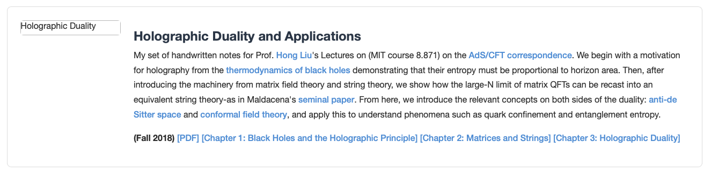

- render the page locally with `open index.html`

## Distill courses

The `courses/` directory is auto-generated by the [Distill](https://github.com/TAOGenna/Distill) project. Don't edit it by hand.

To update after generating new courses:
```
cd ~/Desktop/kenyi/projects/Distill
uv run distill publish
```

This builds static HTML from `Distill/output/`, copies it to `courses/`, and commits+pushes here. The destination path is saved in `~/.config/distill/config.json` under `publish_to`.

To change the destination: `uv run distill publish --to /new/path/to/courses`

## Cards

- here's an example of a card
```
	<div class="publication-card">
		<div class="row">
			<div class="col-4 col-md-2">
				
			</div>
			<div class="col-8 col-md-10">
				<h4>some title</h4>
				<p>
                some text
                </p>
				<p><strong>(Fall 2018)</strong>
					a footer
				</p>
			</div>
		</div>
	</div>
```

Result: 

