*Comprehensive end-of-course project report.*

# Problem

Design[^liberties] a system that implements a 3-channel radio-over-fiber (RoF) link using
optical single-sideband modulation. Use a passive filtering technique to reduce the
carrier-to-sideband ratio (CSR) so as to improve the link's performance. The optical
carrier frequencies must be separated by $0.4$ nm ($50$ GHz), the RF carriers must lie in
the $18$–$28$ GHz range, and each channel's data rate must be $2.5$ Gb/s with PAM-2 NRZ
modulation. The system corresponds to a $20$ km optical fiber link.

[^liberties]: I take some liberties with the given parameters so that the system works and shows what the exercise expects.

- Analyze the system's spectral response in both the electrical and optical domains.
- Verify correct operation from the eye diagram after electrical reception (demodulation).
- Analyze the system's response when no CSR-reduction technique is used.

What follows explains how I understand the proposed problem and the general reasoning behind
why certain components are used.

# Radio-over-fiber and photodetectors

In RoF systems, information is carried over optical fibers using modulated light (the
*optical carriers*). The modulation can encode RF signals onto this light. At the receiver,
the goal is to recover that RF information from the modulated light, and here we do it with a
photodetector. Photodetectors are designed to convert optical signals into electrical
signals: they absorb photons and generate an electrical current.

These optical carriers are generated from a *CW laser*. They take the form of light at a
specific wavelength (such as $1550$ nm in telecommunication systems). We use these carriers
to transport information over the optical fiber.

*RF carriers*, on the other hand, are electromagnetic signals at much lower frequencies
(typically from kilohertz to gigahertz). In RoF systems these RF signals modulate the optical
carriers: the RF signal modifies certain properties of the optical carrier, leaving a
"fingerprint" on it.

An important point is that photodetectors do not detect the optical carriers directly. They
are not designed to distinguish between optical frequencies (wavelengths); they simply convert
incident light into an electrical signal. Moreover, the optical carrier frequency (on the
order of THz for infrared light) is far beyond the bandwidth capabilities of electronic
components, photodetectors included. What is converted and detected is the *modulation* of
the optical carrier, not the carrier frequency itself. This electrical signal from the
photodetector contains the modulation, which is essentially the RF carrier signal.

# Sideband generation

Amplitude modulation of a carrier signal usually results in two mirrored *sidebands*. To
achieve this in the proposed system we use a Mach-Zehnder modulator to generate the sidebands
in the frequency domain. An OptiSystem scheme for this is shown below. Using an optical
carrier of $1552.52$ nm and an RF carrier of $20$ GHz ($\sim 0.14989$ nm), we expect frequency
peaks at $f_o \pm f_c = 1552.370,\ 1552.669$ nm. These numbers show up very close to the
simulation values. Note as well the difference in amplitude between the optical carrier and
the sidebands — recall that we are on a logarithmic dBm scale.

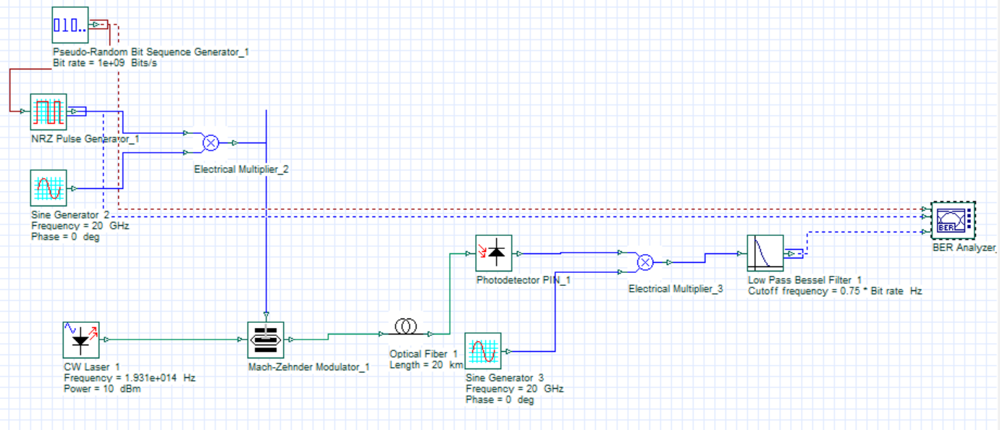
*Scheme to obtain a RoF signal with sidebands.*

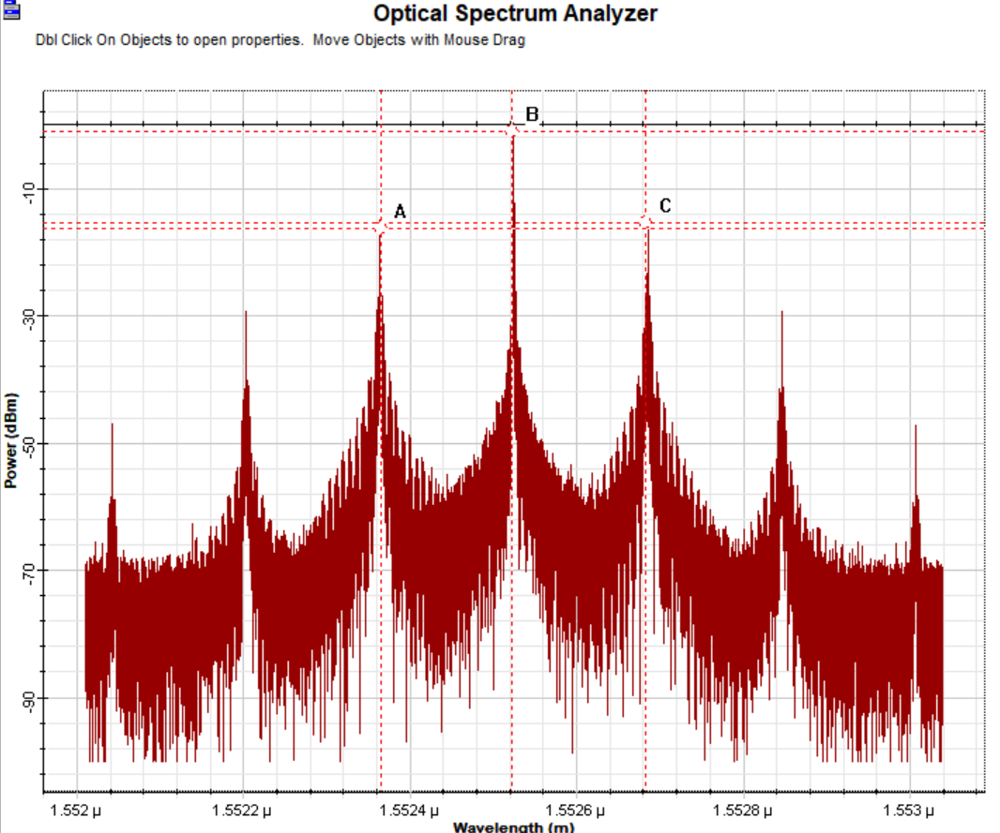
*Sidebands for $f_o = 1552.52$ nm and RF of $20$ GHz. Point A marks $x = 1552.3641$ nm, point B $x = 1552.5227$ nm, and point C $x = 1552.6829$ nm.*

# Single-sideband generation

In an optical modulation system using a Mach-Zehnder modulator (MZM), it is possible to
suppress one of the sidebands generated during modulation. This is done by introducing a
specific phase shift in one of the MZM's arms, normally set to $\pi/2$ or $-\pi/2$ radians.

The MZM operates on the interference of two optical waves traveling through its two arms.
Applying an RF signal to the modulator changes the refractive index in one or both arms, which
produces a phase change in the light passing through them. When the light waves recombine at
the MZM output, the resulting interference pattern varies in time, following the RF signal —
which is equivalent to modulating the amplitude of the optical carrier.

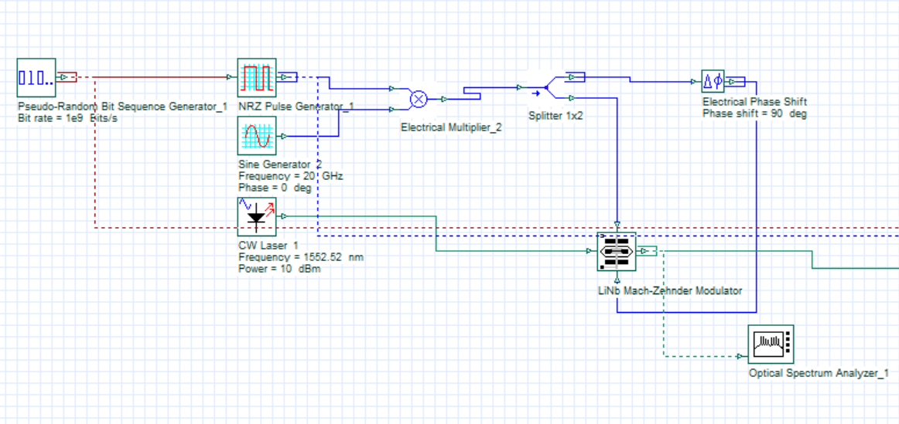
*OptiSystem scheme to obtain a single sideband.*

In the scheme above, we phase-shift one of the input arms of the Mach-Zehnder modulator by
$90°$. Opening the optical spectrum analyzer, we see that the sideband at $\lambda = 1552.669$
nm is attenuated in amplitude, while the optical carrier and the other sideband are barely
affected.

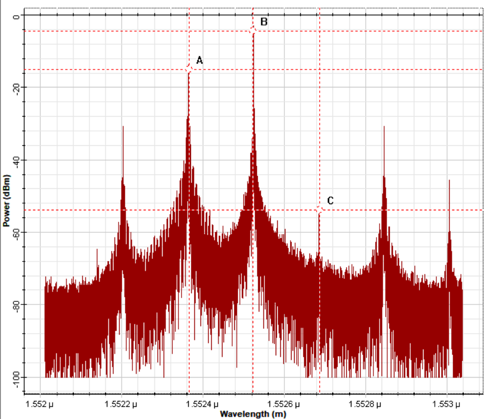
*Optical spectrum analyzer for the single-sideband case.*

# Demodulation

In a RoF system, after the optical signal has been converted to an electrical signal by the
photodetector, a demodulation step is essential to recover the original RF signal. For this we
use a sine-pulse generator at the same frequency as the RF signal used in the modulation stage
at the start of the system.

The reason for using a sine generator at the same frequency lies in the demodulation method —
commonly known as mixing or homodyne detection. The electrical signal from the photodetector,
which carries the modulated RF information, is mixed with a locally generated reference signal
of the same frequency as the original RF signal. Mixing the two produces constructive and
destructive interference that extracts the modulated RF information.

The precision of the sine generator's frequency is crucial for successful demodulation. If it
does not match the original RF frequency exactly, the interference is not optimal, leading to
inefficient recovery of the information and a degraded demodulated signal. In the eye diagram,
large differences appear if we use frequencies that do not match exactly — that is, the
demodulation will not match the originally transmitted signal.

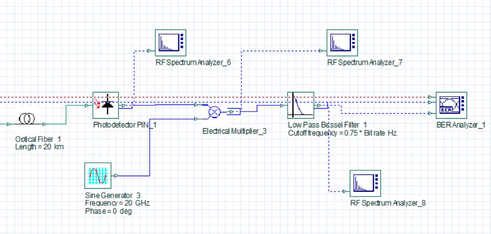
*Continuation of the previous scheme, showing the electrical pulse used for demodulation.*

The figure above shows the components used for demodulation **for a single-channel system**.
The low-pass filter lets us ignore the higher frequencies, leaving only the *envelope* of the
signal. Finally, we compare the demodulated signal against the originally transmitted signal
through the eye diagram.

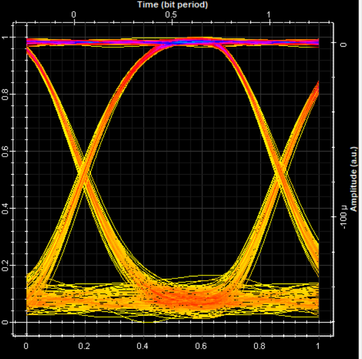
*BER analyzer for the single-channel system.*

# The complete 3-channel system

To build the 3-channel system we multiplex three blocks like the single-channel one above. At
the multiplexer output we then expect three optical carriers, each with two sidebands — one of
which has already been attenuated, so in power terms it can be ignored. The full-system scheme
includes signal generation, filters to attenuate the optical carriers, and finally
demodulation of the electrical signal.

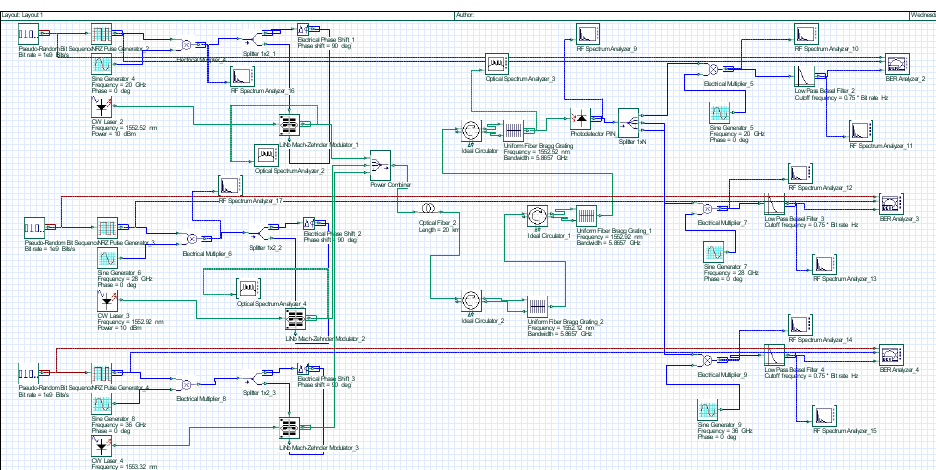
*Schematic for the complete 3-channel system.*

## Two-channel system

As a test, I started with a two-channel system. For both channels the eye diagram is shown to
confirm that the signal is being demodulated correctly.

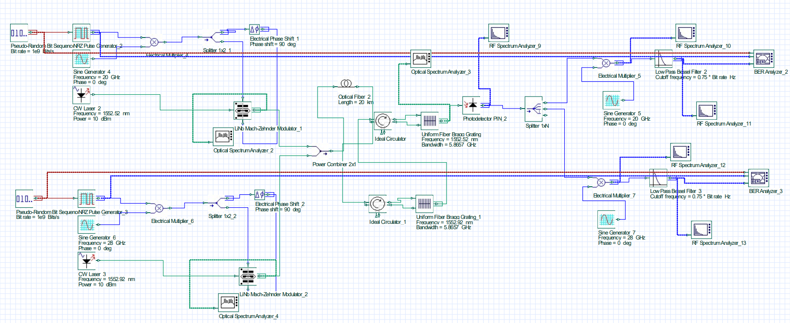
*Scheme for a two-channel system. Both channels use single-sideband modulation and passive filtering to attenuate the optical carriers.*

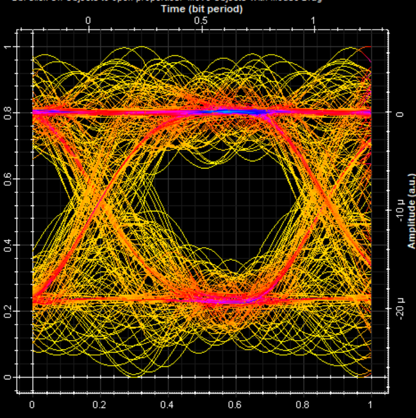
*Two-channel system: eye diagram for the first channel.*

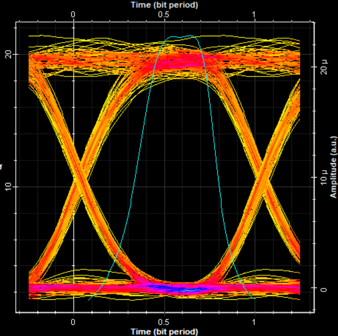
*Two-channel system: eye diagram for the second channel.*

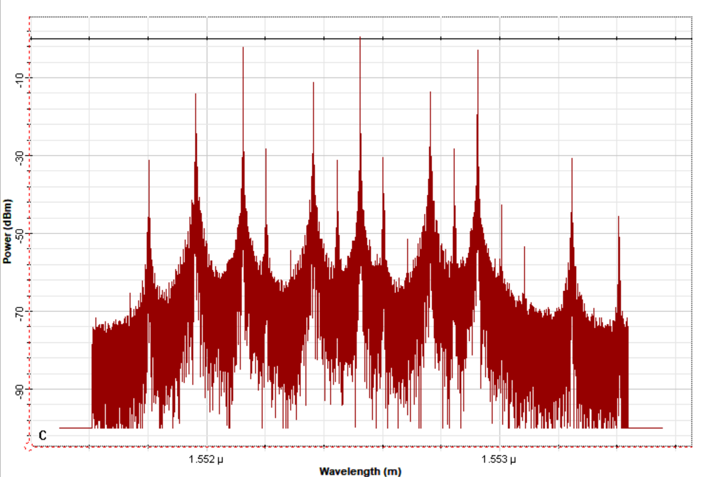
*Spectrum at the multiplexer output for the 3-channel system.*

## Three-channel system

Signal parameters:

- **Channel 1:** CW laser $\lambda = 1553.32$ nm, sine generator frequency $36$ GHz.
- **Channel 2:** CW laser $\lambda = 1552.92$ nm, sine generator frequency $28$ GHz.
- **Channel 3:** CW laser $\lambda = 1552.52$ nm, sine generator frequency $20$ GHz.

Layout parameters:

- Bit rate: $10^9$ bits/s
- Sequence length: $128$ bits
- Samples per bit: $1024$
- Number of samples: $131072$

The eye diagrams for the complete system are shown below. At first I thought there might be
high-power electrical frequencies not being captured by the layout properties, but after
increasing that range there was no appreciable change, so the source of error must come from
elsewhere. Comparing against the two-channel results suggests that a many-channel
implementation would require more aggressive filtering.

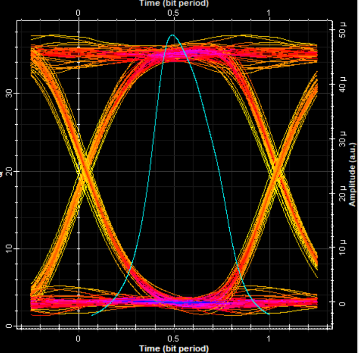
*Eye diagram for the optical carrier $\lambda = 1553.32$ nm and RF carrier of $36$ GHz.*

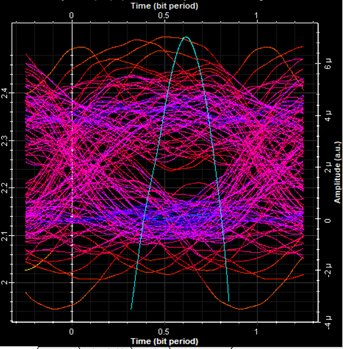
*Eye diagram for the optical carrier $\lambda = 1552.92$ nm and RF carrier of $28$ GHz.*

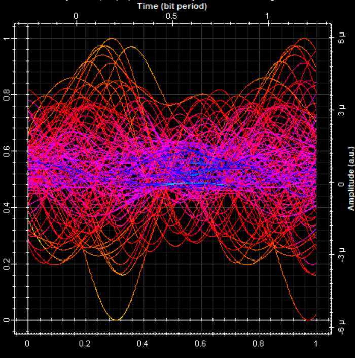
*Eye diagram for the optical carrier $\lambda = 1552.52$ nm and RF carrier of $20$ GHz.*

## Other implementation ideas

A more optimal way to send the signal would be to make better use of the bandwidth — i.e.,
shift the RF carriers to the left so they end up within the range $[f_{o,1} - f_{c,1},\ f_{o,1}]$
while leaving the optical carriers intact. Any *overlapping* between the RF carriers would have
to be accounted for, so that the highest-power frequencies are not too close together and the
signal can still be demodulated correctly.

# Reducing the CSR (carrier-to-sideband ratio)

*The following is in the context of the 3-channel system.*

Fiber Bragg gratings (FBGs) work by selectively reflecting certain wavelengths and letting
others pass. This is achieved by creating a periodic pattern of refractive-index variations in
the core of the optical fiber.

In a RoF system where a Mach-Zehnder modulator generates amplitude-modulated signals, FBGs can
be used to effectively filter one side of the band (upper or lower) near the optical carrier.
This reduces the CSR by attenuating or eliminating one of the sidebands, while the other
sideband — which carries the information — is preserved.

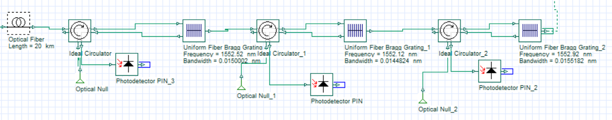
*FBGs chained together, each centered near one of the optical carrier frequencies.*

Before the FBGs, the power difference between the sidebands and the carrier is about $12$ dBm.
Once the signal passes through them, that difference is reduced to $\sim 2$ dBm.

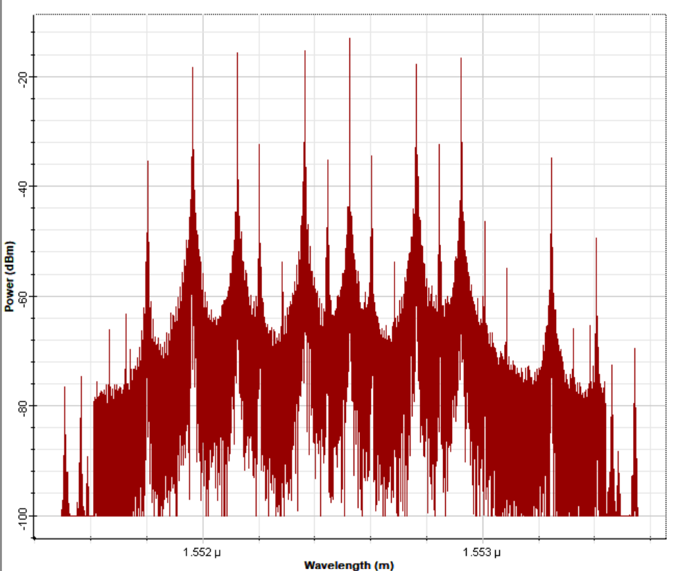
*Frequency spectrum after the signal passes through the FBG chain.*
